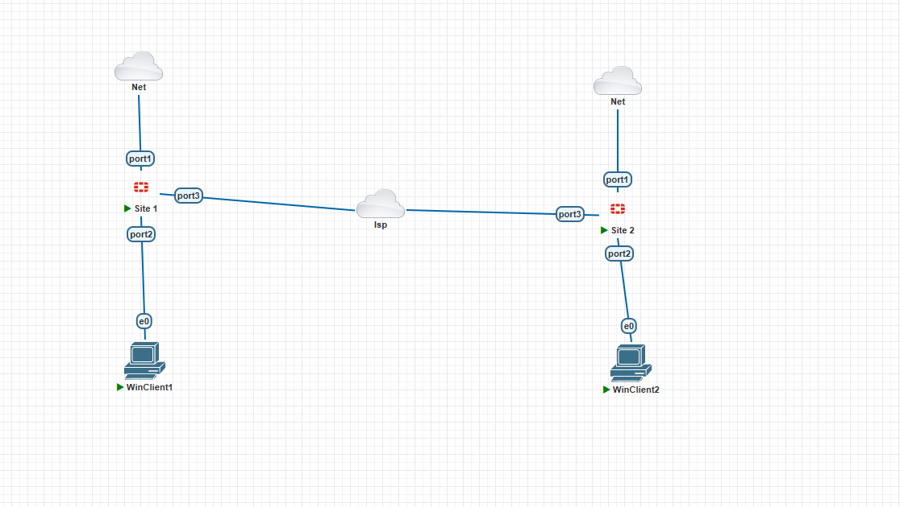
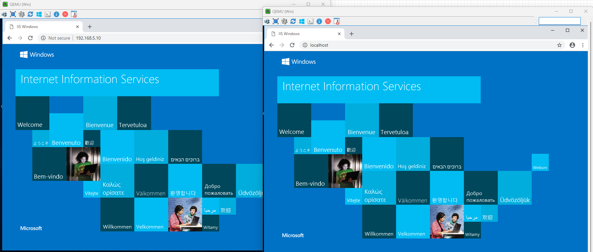
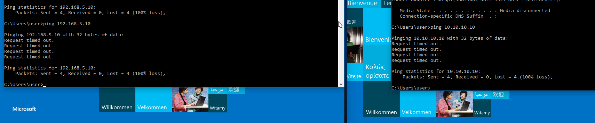

# VPN Site-to-Site con FortiGate

## Objetivo

Implementar una VPN IPsec Site-to-Site entre dos sedes utilizando FortiGate, permitiendo únicamente el acceso a los servicios web (HTTP y HTTPS) a través del túnel VPN.

---

## Topología

---

## Tecnologías utilizadas

- FortiGate
- FortiOS CLI
- VPN IPsec
- PnetLab
- Firewall Policies

---

## Configuración realizada

- Configuración del túnel VPN IPsec entre ambas sedes.
- Creación de las políticas de firewall.
- Configuración de las rutas necesarias para el tráfico entre redes.
- Restricción del acceso únicamente a los servicios HTTP y HTTPS.

---

## Validación de la conectividad

### Acceso Web

La comunicación entre las sedes se logró correctamente mediante el acceso a los servicios **HTTP** y **HTTPS**, ya que las políticas de firewall permitían únicamente estos protocolos a través del túnel VPN.

---

### Prueba de Ping

Las pruebas de **ICMP (Ping)** fallaron de forma intencional. Esto se debe a que el protocolo ICMP no fue permitido en las políticas de firewall configuradas para la VPN.

El comportamiento confirma que únicamente el tráfico autorizado (HTTP y HTTPS) puede atravesar el túnel VPN, aplicando el principio de **mínimo privilegio**.

---

## Resultado

VPN IPsec establecida correctamente.

Acceso mediante HTTP y HTTPS permitido.

Las políticas de firewall controlan el tráfico autorizado.

El tráfico ICMP permanece bloqueado según la configuración de seguridad.

## Lecciones aprendidas

- Comprendí la importancia de definir políticas de firewall específicas para cada servicio.
- Verifiqué que una VPN no implica permitir todo el tráfico entre redes.
- Aprendí a validar el funcionamiento del túnel mediante pruebas de conectividad controladas.
- Apliqué el principio de mínimo privilegio permitiendo únicamente HTTP y HTTPS.
